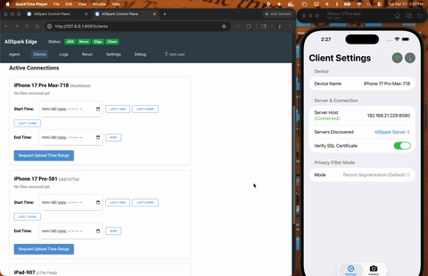

# AllSpark Edge Server



[1080p HD Demo](docs/allspark-mobile-demo-1080p.mp4)

This server provides HTTP and WebSocket endpoints for AllSpark video capture, upload, and remote command execution.

For detailed architecture diagrams, feature requirements, and source file index, see **[REQUIREMENTS.md](REQUIREMENTS.md)**.

See also: **[CHANGELOG.md](CHANGELOG.md)**

## Setup With Agents

Full stack setup (Agents/Data-Capture/Mobile):
- [AllSpark Agentic Framework](https://github.boschdevcloud.com/Reliable-Distributed-Systems/allspark-agentic-framework)
- [AllSpark Rerun Data Plane Dashboard]()
- AllSpark Edge Server APIs (**this repo**)
- AllSpark Control Plane GUI Dashboard (**this repo**)
- [AllSpark Mobile App](https://github.com/WiseLabCMU/AllSpark-iOS)

Follow the [Testing Agentic Integration](TESTING_AGENT_INTEGRATION.md) setup documentation.

## Setup Standalone - NO Agents

Short stack setup (Mobile):
- AllSpark Edge Server APIs (**this repo**)
- AllSpark Control Plane GUI Dashboard (**this repo**)
- [AllSpark Mobile App](https://github.com/WiseLabCMU/AllSpark-iOS)

```bash
# Start the API daemon
python3 -m venv venv && source venv/bin/activate
pip install -r python/requirements.txt

# Start the API Daemon and Control Plane dashboard
python main.py
```

Then open the Control Plane dashboard at [http://localhost:8081](http://localhost:8081).

## Directory Structure

```
AllSpark-edge-server/
├── python/
│   ├── config.yaml                  # ← Unified config (mobile_client, control_plane, agentConfig)
│   ├── server.py                    # aiohttp Edge Server (port 8080)
│   ├── agent_service/               # Agent integration package
│   │   ├── __init__.py
│   │   ├── models.py                # AnomalyRequest / AgentResponse dataclasses
│   │   ├── client.py                # AgentApiClient – analyze_anomaly + continue_session
│   │   └── response_store.py        # AnomalyResponseStore (file-system persistence)
│   ├── control_plane/
│   │   ├── main.py                  # NiceGUI Control Plane (port 8081)
│   │   ├── theme.py                 # Header nav: Agent · Clients · Rerun · Settings· Debug
│   │   └── pages/
│   │       ├── agent.py             # Primary investigation UI (two-column, Open in ADK)
│   │       └── debug.py             # Manual Trigger form (developer / test use)
│   └── tests/
│       ├── test_agent_service.py    # Unit + async integration tests
│       ├── submit_anomaly_to_edge.py # CLI tool – new anomaly submission
│       └── e2e_agent_workflow.py    # CLI smoke-test against a running server
├── REQUIREMENTS.md                  # Architecture & requirements
├── docs/                            # Protocol docs and images
├── examples/                        # Example clients and scripts
├── keys/                            # SSL certificates
├── third-party/                     # Local frontend dependencies
├── uploads/                         # Upload directory root, auto-created
│   ├── mobile_clients/              # Default destination for mobile app uploads
│   └── agent_responses/             # Agent analysis results
│       └── Anomaly_YYYY-MM-DD/
│           └── HHMMSS_<uuid>/
│               ├── response.json         # Full AgentResponse as JSON
│               ├── summary.txt           # Human-readable text summary
│               ├── request.json          # Original AnomalyRequest as JSON
│               ├── session_info.txt      # ADK session lookup info
│               ├── video_clips/          # Video clip(s) for this anomaly
│               └── machine_anomaly_data/ # Machine/sensor anomaly data
```

## Prerequisites

- Python 3
- OpenSSL (for generating test certificates)

## Configuration

Both servers read from `python/config.yaml`. Missing values are filled from defaults.

For detailed architecture, refer to the [System Context diagram in REQUIREMENTS.md](REQUIREMENTS.md#system-context).

### config.yaml reference

The file has two top-level sections: `mobile_client` (API server, port 9080) and
`control_plane` (NiceGUI dashboard + Rerun viewer, port 9081).

#### Fields you must edit per deployment

| Field | Local dev | Remote VM (HtvP) | Notes |
|---|---|---|---|
| `mobile_client.agentConfig.agent_url` | `http://localhost:8000/run` | `http://host.containers.internal:8000/run` | `host.containers.internal` resolves to the container host in Docker/Podman |
| `mobile_client.agentResponsePath` | `uploads/agent_responses/` | `uploads/agent_responses/` or `/net/htvvm662/fs0/anomaly_events/` | Use the NFS path on remote to write responses directly to the shared share |
| `mobile_client.anomalyEventDirs` | *(omit or leave empty)* | `- /net/htvvm662/fs0/anomaly_events` | Extra dirs the dashboard scans for anomaly folders written by kafka-profiler |
| `control_plane.rerunExternalHost` | `localhost` | `10.76.8.217` | Browser-facing hostname for the Rerun viewer iframe and "Open in New Window" URL — must be reachable from the user's browser |

#### Full annotated example (remote VM)

```yaml
mobile_client:
  hostname: 0.0.0.0          # bind interface — keep 0.0.0.0 in container
  port: 9080                 # API port (must match docker -p mapping)
  autoUpload: true
  serviceName: AllSpark Server
  keyFile: keys/test-private.key
  certFile: keys/test-public.crt
  uploadPath: uploads/
  clientUploadsPath: uploads/mobile_clients/

  # Where the edge server writes agent response folders.
  # Local: uploads/agent_responses/  (inside the container volume)
  # Remote: /net/htvvm662/fs0/anomaly_events/  (NFS share, shared with kafka-profiler)
  agentResponsePath: uploads/agent_responses/

  # Additional directories to scan for Anomaly_*/ folders written by kafka-profiler.
  # Each must be an absolute path that is bind-mounted into the container.
  anomalyEventDirs:
    - /net/htvvm662/fs0/anomaly_events

  keepAliveIntervalMs: 5000

  agentConfig:
    # URL of the ADK /run endpoint.
    # - Local dev (no container): http://localhost:8000/run
    # - Inside container (Docker/Podman host network): http://host.containers.internal:8000/run
    # - Explicit IP (if host.containers.internal not supported): http://10.76.8.217:8000/run
    agent_url: http://host.containers.internal:8000/run
    agent_app_name: allspark_agent
    agent_user_id: user
    agent_session_id: edge_session
    agent_timeout: 900           # seconds — increase for long video analysis
    agent_init_message: Hey, can you help me do some analysis?

  clientConfig:                  # mobile app negotiation — usually leave unchanged
    videoFormat: mp4
    audioFormat: wav
    fps: 30.0
    videoChunkDurationMs: 10000
    videoBufferMaxMB: 16000
    communicationsPolicy:
      wifi: true
      cellular: true
      ethernet: true
      usb: true

control_plane:
  port: 9081                     # Dashboard port
  storageSecret: allspark-secret

  # rerunHost: internal TCP probe used by the server to check if the Rerun
  # web-viewer process has started. Keep as localhost — do NOT set to the
  # public IP here, or the health-check will fail inside the container.
  rerunHost: localhost

  # rerunExternalHost: hostname the *browser* uses to open the Rerun iframe.
  # - Local dev: localhost
  # - Remote VM: the VM's LAN IP (e.g. 10.76.8.217) reachable from your browser
  rerunExternalHost: 10.76.8.217

  rerunPort: 9090                # Rerun web viewer port
  rerunGrpcPort: 9876            # Rerun gRPC ingest port (SDK → viewer)

  logPaths:
    anomalyLogs: logs/anomalies/
    rigLogs: logs/data/datacapture-rig
```

#### Local dev (no Docker)

```yaml
mobile_client:
  agentResponsePath: uploads/agent_responses/
  anomalyEventDirs: []           # or omit entirely
  agentConfig:
    agent_url: http://localhost:8000/run
control_plane:
  rerunHost: localhost
  rerunExternalHost: localhost
```

#### Updating config on the remote without a full rebuild

```bash
# Edit locally, then copy to the remote deploy directory
scp AllSpark-edge-server/python/config.yaml user@10.76.8.217:~/allspark-edge/config.yaml
# Restart the container to pick up the new file (bind-mounted — no rebuild needed)
ssh user@10.76.8.217 'podman restart allspark-edge-server'
```

## SSL Certificates

Generate a self-signed certificate for WSS/HTTPS (one-time):

```bash
mkdir -p keys
openssl req \
    -new \
    -newkey rsa:2048 \
    -days 365 \
    -nodes \
    -x509 \
    -subj "/CN=localhost" \
    -keyout keys/test-private.key \
    -out keys/test-public.crt
```

## Agent Service

The edge server includes an agentic analysis pipeline that sends anomaly data (video clips, MQTT logs, sensor readings)
to the [AllSpark Agentic Framework](https://github.boschdevcloud.com/Reliable-Distributed-Systems/allspark-agentic-framework) for AI-powered root cause analysis.

### Submitting an Anomaly for Analysis

```bash
cd python
python tests/submit_anomaly_to_edge.py \
    --clip-path /path/to/anomaly_clip_20260413_120000.mp4 \
    --anomaly-time 2026-04-13T12:00:00 \
    --error "missed expected message" \
    --expected-topic allspark/anomaly_detected
```

The timestamp is auto-derived from the clip filename if `--anomaly-time` is omitted.

### Agent Response Storage Layout

Responses are stored under `uploads/agent_responses/` (configurable via `agentResponsePath` in `python/config.yaml`):

```
uploads/agent_responses/
└── Anomaly_2026-04-13/
    └── 120000_a3f9b2/
        ├── response.json         ← full AgentResponse (raw agent output + metadata)
        ├── summary.txt           ← human-readable text summary
        ├── request.json          ← original AnomalyRequest sent to the agent
        ├── session_info.txt      ← ADK session ID and web UI lookup instructions
        ├── video_clips/          ← video clip(s) associated with this anomaly
        └── machine_anomaly_data/ ← machine/sensor data files for this anomaly
```

## API Reference

See **[docs/endpoints.md](docs/endpoints.md)** for the full REST API definitions, WebSocket message protocols, and Agentic Framework routing schemas.

## Web Interface

The control interface at `http://localhost:8081` shows active connections, agent responses, and allows launching investigations in the ADK.

### Header Navigation

| Link | URL | Purpose |
|---|---|---|
| **Status** | | Online/Offline status for each service: ADK, Rerun, Edge, Client |
| **Agent** | `/agent` | Full-width response feed + "Continue Investigation" (embedded ADK viewer) |
| **Clients** | `/clients` | Live websocket connection monitoring and mobile upload requests |
| **Rerun** | `/rerun` | 3D data plane scrubber and visualization via Rerun.io |
| **Settings** | `/settings` | Dynamic UI bound directly to the active `config.yaml` state |
| **Debug** | `/debug` | Manual anomaly submission form (developer / test use) |
| **👤 test-user** | | Placeholder for future account management |

Example Agent Page:


Example Clients Page:


## Dashboard — Anomaly Agent Feed (`/agent`)

The Agent page is a live-updating factory-floor monitor that polls for new agent responses and renders them as anomaly cards in a two-column layout.

### Two-Column Layout

| Column | Content |
|---|---|
| **Left (220 px)** | Top-5 error frequency histogram — horizontal bar chart built from `interarrival_stats.json` (Kafka lookback counts) merged with live agent response counts |
| **Right (flex)** | Anomaly cards, newest first, with severity colour-coding, triage chips, and inline video panels |

### Error Frequency Histogram

- Counts are the **`max(Kafka lookback, live response)`** per error code — prevents double-counting since agent responses are a subset of the same Kafka events.
- `interarrival_stats.json` is read with **mtime-based caching** — disk is only accessed when the file actually changes between poll ticks.
- The chart is only redrawn when the underlying error data changes (`chart_sig` guard), eliminating flicker on quiet polls.
- Error code descriptions are loaded once at startup from `python/error_codes.csv` (semicolon-delimited: `Machine Error Code;Error Text;MES error Code`) and displayed as a legend beneath the chart.

### Inline Video Playback

Browsers cannot access NFS paths directly and cannot always decode raw NVR clips. The solution is a three-layer pipeline:

**1. `/api/clip-video` HTTP endpoint (`main.py`)**
The NFS clip path is base64url-encoded into a query parameter. The server validates the decoded path is under a known `anomalyEventDirs` root (preventing path traversal), then streams the file. The raw NFS path never reaches the browser.

**2. FFmpeg H.264 sidecar (`_ensure_h264_sidecar`)**
If the clip is not already a browser-compatible `.h264.mp4`, `ffmpeg` creates a sidecar file alongside the original with the `faststart` flag — moving the `moov` atom to the front so the browser can begin streaming without downloading the whole file. Subsequent requests for the same clip serve the already-transcoded sidecar immediately.

**3. HTML5 `<video>` inside a `ui.expansion` (NiceGUI)**
`ui.html()` injects a standard `<video controls src="...">` element directly into the page. The browser's native video stack handles buffering, seeking, and codec support — no third-party player needed. Each video panel is **collapsed by default** so no data is fetched until the engineer opens it.

**Multi-camera support (`clip_paths`)**
`response_store.py` scans `video_anomaly_data/` for all `clip_ch*.mp4` files and populates a `clip_paths` list (deduped by stem so `.h264.mp4` sidecars don't duplicate raw clips). Each clip gets its own labelled expansion panel ("Camera 1", "Camera 2", …) with an independent `<video>` element.

### NVR Clip Wait (`server.py`)

When the Kafka profiler submits an anomaly, the NVR may still be writing the clip. `server.py` waits up to 360 s before dispatching to the agent:
- Initial 120 s sleep (nominal NVR clip duration).
- Then polls every 10 s via `asyncio.to_thread` (NFS `glob` runs in a thread pool so the event loop is not blocked).
- A `_pending_tasks` set holds strong references to prevent GC of in-flight tasks.

### Filters

| Filter | Behaviour |
|---|---|
| **All / Critical / Flagged / Agent Errors** | Toggle bar filters visible cards by severity |
| **Since last restart** | Hides anomalies submitted before the edge server last booted (uses `created_at` timestamp, not file mtime) — unchecked by default so full history is visible |

---

## Known Limitations

- Communications policy (`communicationsPolicy` in `clientConfig`) is advisory to iOS clients — the server sets desired state but cannot enforce radio changes on devices
- UWB, NFC, and Satellite policy keys are defined but enforcement is deferred on iOS (no public API); may be enforceable on other platforms (e.g. Android)

## Troubleshooting

| Problem | Fix |
|---------|-----|
| Connection not found | Verify `connectionId` via `GET /api/status`; ensure client is still connected |
| File write errors | Check `uploads/` is writable and disk space is available |
| Binary data before metadata | Always send metadata JSON before binary data |
