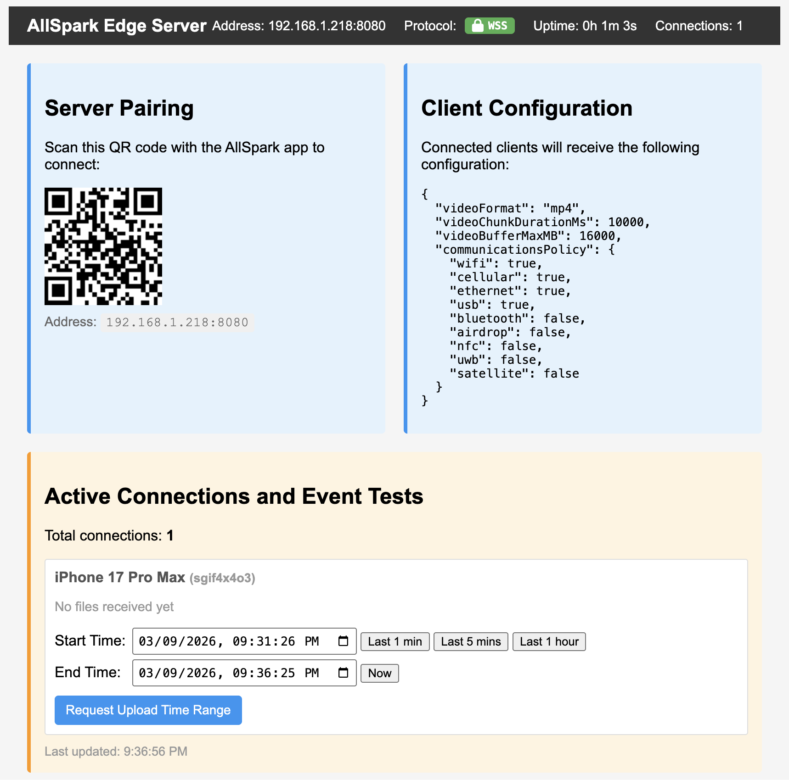

# AllSpark Edge Server

This server provides HTTP and WebSocket endpoints for testing AllSpark functionality, including video file uploads and remote command execution.

## Directory Structure

```
AllSpark-edge-server/
├── config.json         (Shared configuration)
├── index.html          (Shared web interface)
├── docs/               (Documentation and images)
├── examples/           (Example clients and scripts)
├── keys/               (Shared SSL certificates)
├── third-party/        (Local frontend dependencies)
├── uploads/            (Shared upload directory)
├── node/               (Node.js Server implementation)
└── python/             (Python Server implementation)
```

## Requirements
- Node.js
- Python 3
- OpenSSL (for generating test certificates)

## Features
- **HTTP & WebSocket Server**: Handles connection upgrades and video stream uploads.
- **Bonjour/mDNS Advertising**: Automatically advertises service as `_allspark._tcp` for client discovery.
- **Client Configuration Sync**: Pushes configuration (chunk duration, storage limits) to connected clients.
- **Remote Commands**: Send commands to clients to request video uploads for specific time ranges.
- **Dual Implementation**: Available in both Node.js and Python (aiohttp).

## Configuration

Both servers read configuration from `config.json` in the project root (parent of the server directories). If the file is not found, defaults are used.

> [!NOTE]
> You can only run **one** server at a time if they are configured to use the same port (default: 8080).

**Default Configuration:**
```json
{
  "hostname": "0.0.0.0",
  "port": 8080,
  "serviceName": "AllSpark Server",
  "keyFile": "../keys/test-private.key",
  "certFile": "../keys/test-public.crt",
  "uploadPath": "../uploads/",
  "clientConfig": {
    "videoFormat": "mp4",
    "videoChunkDurationMs": 30000,
    "videoBufferMaxMB": 16000
  }
}
```

### Configuration Options
- **serviceName**: The name advertised via Bonjour (default: "AllSpark Server")
- **clientConfig**: Settings pushed to clients upon connection
  - **videoFormat**: Preferred video encoding ("mp4" or "mov")
  - **videoChunkDurationMs**: Duration of recording chunks in milliseconds
  - **videoBufferMaxMB**: Max storage usage on client before old files are deleted

## SSL Certificates

Generate a testing-only self-signed certificate to secure the websocket transport (you only need to do this once):

```bash
mkdir -p keys
openssl req \
    -new \
    -newkey rsa:2048 \
    -days 365 \
    -nodes \
    -x509 \
    -subj "/CN=localhost" \
    -keyout keys/test-private.key \
    -out keys/test-public.crt
```

## Running the Servers

### Node.js Server

1. **Navigate to the node directory:**
   ```bash
   cd node
   ```

2. **Install dependencies:**
   ```bash
   npm install
   ```

3. **Start the server:**
   ```bash
   node server.js
   ```

### Python Server

1. **Navigate to the python directory:**
   ```bash
   cd python
   ```

2. **Set up a virtual environment (recommended):**
   ```bash
   python3 -m venv venv
   source venv/bin/activate
   ```

3. **Install dependencies:**
   ```bash
   pip install -r requirements.txt
   ```

4. **Start the server:**
   ```bash
   python server.py
   ```

### Quick WebSocket Test
Using [`websocat`](https://github.com/vi/websocat):
```bash
websocat --insecure wss://localhost:8080
```

## Endpoints

Detailed documentation for the REST API and WebSocket protocols can be found in [docs/endpoints.md](docs/endpoints.md).

## Upload Directory

Uploaded files are stored in the `uploads/` directory, which is created automatically if it doesn't exist.

## Web Interface (index.html)

The server provides a web-based control interface at `http://localhost:8080` for monitoring connections and sending remote commands.



### Features

1. **Active Connections List**
   - Shows all connected clients with their display names
   - Device names automatically sent by clients (customizable in Settings)
   - Format: "CustomName (DeviceModel)" or just "DeviceModel"
   - Connection ID shown in smaller text below the name
   - Displays metadata status and received data status
   - Real-time updates every 5 seconds

2. **Request Upload Time Range**
   - **Start Time / End Time**: Date and time pickers to define the range of video to request.
   - **Quick Presets**: "Last 1 min", "Last 5 mins", "Last 1 hour", "Now".
   - **Request Upload Button**: Sends the `uploadTimeRange` command to the client.
   - **Persistence**: Remembers selected times per connection ID.

### Example Workflow

1. Navigate to `http://localhost:8080` in a web browser
2. View connected iOS devices in the "Active Connections" section
3. Select a time range (e.g., "Last 5 mins") using the preset buttons or date pickers
4. Click "Request Upload Time Range"
5. Client receives command and automatically:
   - Checks local storage for recordings within that range
   - Uploads any matching files to the server
   - Files appear in `uploads/` directory on the server

## Troubleshooting

**Connection not found:**
- Verify the `connectionId` is correct via `/api/status`
- Ensure the client connection is still active

**File write errors:**
- Check that the `uploads/` directory is writable
- Verify disk space is available

**Binary data before metadata:**
- Ensure metadata JSON is sent first before any binary data
- Server will reject binary data received before metadata with an error message
