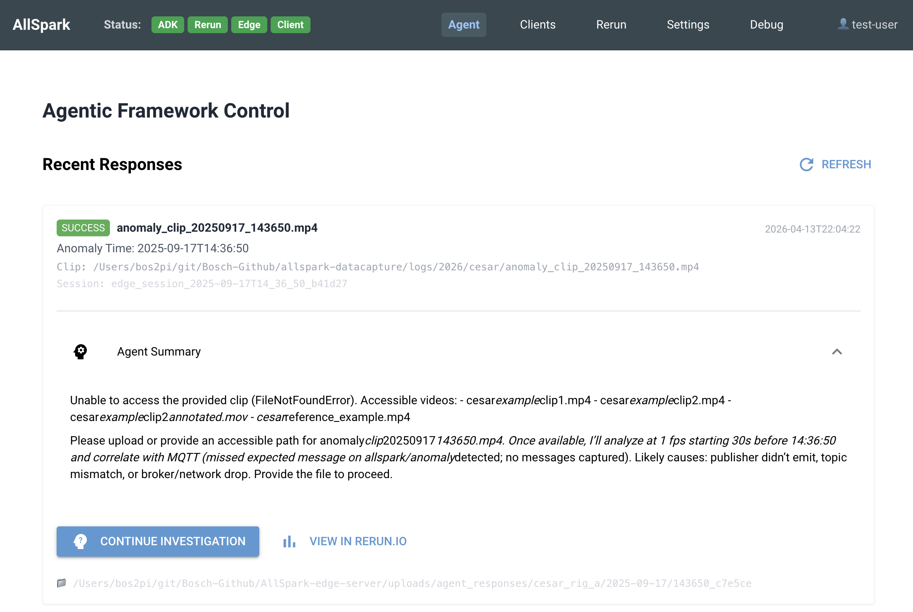
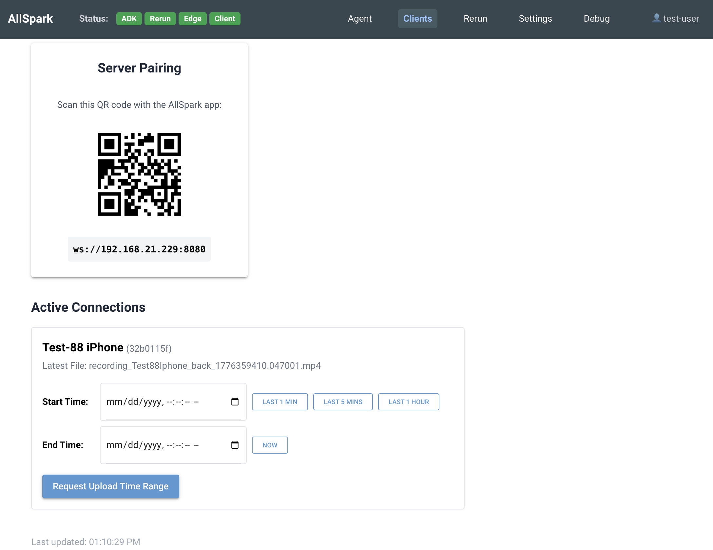

# AllSpark Edge Server

This server provides HTTP and WebSocket endpoints for AllSpark video capture, upload, and remote command execution.

For detailed architecture diagrams, feature requirements, and source file index, see **[REQUIREMENTS.md](REQUIREMENTS.md)**.

See also: **[CHANGELOG.md](CHANGELOG.md)**

## Setup With Agents

Full stack setup (Agents/Data-Capture/Mobile) setup:
- [AllSpark Agentic Framework](https://github.boschdevcloud.com/Reliable-Distributed-Systems/allspark-agentic-framework)
- [AllSpark Rerun Data Plane Dashboard]()
- AllSpark Edge Server APIs (**this repo**)
- AllSpark Control Plane GUI Dashbaord (**this repo**)
- [AllSpark Mobile App](https://github.com/WiseLabCMU/AllSpark-iOS)

Follow the [Testing Agentic Integration](TESTING_AGENT_INTEGRATION.md) setup documementation.

## Setup Standalone - NO Agents

Short stack setup (Mobile) setup:
- AllSpark Edge Server APIs (**this repo**)
- AllSpark Control Plane GUI Dashbaord (**this repo**)
- [AllSpark Mobile App](https://github.com/WiseLabCMU/AllSpark-iOS)

```bash
# Start the API daemon
python3 -m venv venv && source venv/bin/activate
pip install -r python/requirements.txt

# Start the API Daeman and Control Plane dashboard
python main.py
```

Then open the Control Plane dashboard at [http://localhost:8081](http://localhost:8081).

## Directory Structure

```
AllSpark-edge-server/
├── python/
│   ├── config.yaml                  # ← Unified config (mobile_client, control_plane, agentConfig)
│   ├── server.py                    # aiohttp Edge Server (port 8080)
│   ├── agent_service/               # Agent integration package
│   │   ├── __init__.py
│   │   ├── models.py                # AnomalyRequest / AgentResponse dataclasses
│   │   ├── client.py                # AgentApiClient – analyze_anomaly + continue_session
│   │   └── response_store.py        # AnomalyResponseStore (file-system persistence)
│   ├── control_plane/
│   │   ├── main.py                  # NiceGUI Control Plane (port 8081)
│   │   ├── theme.py                 # Header nav: Agent · Clients · Rerun · Settings· Debug
│   │   └── pages/
│   │       ├── agent.py             # Primary investigation UI (two-column, Open in ADK)
│   │       └── debug.py             # Manual Trigger form (developer / test use)
│   └── tests/
│       ├── test_agent_service.py    # Unit + async integration tests
│       ├── submit_anomaly_to_edge.py # CLI tool – new anomaly submission
│       └── e2e_agent_workflow.py    # CLI smoke-test against a running server├── REQUIREMENTS.md     (Architecture & requirements)
├── docs/               (Protocol docs and images)
├── examples/           (Example clients and scripts)
├── keys/               (SSL certificates)
├── third-party/        (Local frontend dependencies)
├── uploads/            (Upload directory root, auto-created)
│   ├── mobile_clients/   (Default destination for mobile app uploads)
│   └── agent_responses/  (Agent analysis results)
│       └── Anomaly_YYYY-MM-DD/
│           └── HHMMSS_<uuid>/
│               ├── response.json         (Full AgentResponse as JSON)
│               ├── summary.txt           (Human-readable text summary)
│               ├── request.json          (Original AnomalyRequest as JSON)
│               ├── session_info.txt      (ADK session lookup info)
│               ├── video_clips/          (Video clip(s) for this anomaly)
│               └── machine_anomaly_data/ (Machine/sensor anomaly data)
```

## Prerequisites

- Python 3
- OpenSSL (for generating test certificates)

## Configuration

Both servers read from `python/config.yaml`. Missing values are filled from defaults.

For detailed architecture, refer to the [System Context diagram in REQUIREMENTS.md](REQUIREMENTS.md#system-context).

## SSL Certificates

Generate a self-signed certificate for WSS/HTTPS (one-time):

```bash
mkdir -p keys
openssl req \
    -new \
    -newkey rsa:2048 \
    -days 365 \
    -nodes \
    -x509 \
    -subj "/CN=localhost" \
    -keyout keys/test-private.key \
    -out keys/test-public.crt
```

## Agent Service

The edge server includes an agentic analysis pipeline that sends anomaly data (video clips, MQTT logs, sensor readings)
to the [AllSpark Agentic Framework](https://github.boschdevcloud.com/Reliable-Distributed-Systems/allspark-agentic-framework) for AI-powered root cause analysis.

### Submitting an Anomaly for Analysis

```bash
cd python
python tests/submit_anomaly_to_edge.py \
    --clip-path /path/to/anomaly_clip_20260413_120000.mp4 \
    --anomaly-time 2026-04-13T12:00:00 \
    --error "missed expected message" \
    --expected-topic allspark/anomaly_detected
```

The timestamp is auto-derived from the clip filename if `--anomaly-time` is omitted.

### Agent Response Storage Layout

Responses are stored under `uploads/agent_responses/` (configurable via `agentResponsePath` in `python/config.yaml`):

```
uploads/agent_responses/
└── Anomaly_2026-04-13/
    └── 120000_a3f9b2/
        ├── response.json         ← full AgentResponse (raw agent output + metadata)
        ├── summary.txt           ← human-readable text summary
        ├── request.json          ← original AnomalyRequest sent to the agent
        ├── session_info.txt      ← ADK session ID and web UI lookup instructions
        ├── video_clips/          ← video clip(s) associated with this anomaly
        └── machine_anomaly_data/ ← machine/sensor data files for this anomaly
```

## API Reference

See **[docs/endpoints.md](docs/endpoints.md)** for the full REST API definitions, WebSocket message protocols, and Agentic Framework routing schemas.

## Web Interface

The control interface at `http://localhost:8081` shows active connections, agent responses, and allows launching investigations in the ADK.

### Header Navigation

| Link | URL | Purpose |
|---|---|---|
| **Status** | | Online/Offline status for each service: ADK, Rerun, Edge, Client |
| **Agent** | `/agent` | Full-width response feed + "Continue Investigation" (embedded ADK viewer) |
| **Clients** | `/clients` | Live websocket connection monitoring and mobile upload requests |
| **Rerun** | `/rerun` | 3D data plane scrubber and visualization via Rerun.io |
| **Settings** | `/settings` | Dynamic UI bound directly to the active `config.yaml` state |
| **Debug** | `/debug` | Manual anomaly submission form (developer / test use) |
| **👤 test-user** | | Placeholder for future account management |

Example Agent Page:


Example Clients Page:


## Known Limitations

- Communications policy (`communicationsPolicy` in `clientConfig`) is advisory to iOS clients — the server sets desired state but cannot enforce radio changes on devices
- UWB, NFC, and Satellite policy keys are defined but enforcement is deferred on iOS (no public API); may be enforceable on other platforms (e.g. Android)

## Troubleshooting

| Problem | Fix |
|---------|-----|
| Connection not found | Verify `connectionId` via `GET /api/status`; ensure client is still connected |
| File write errors | Check `uploads/` is writable and disk space is available |
| Binary data before metadata | Always send metadata JSON before binary data |
