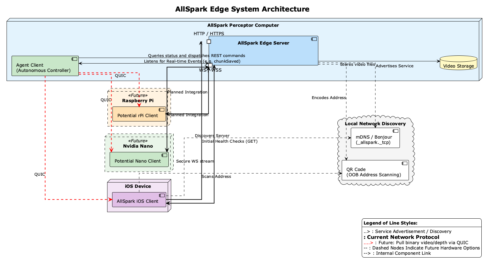

# AllSpark Edge Server

This server provides HTTP and WebSocket endpoints for AllSpark video capture, upload, and remote command execution.

> [!IMPORTANT]
> The AllSpark system consists of this edge server and the [AllSpark iOS App](https://github.com/WiseLabCMU/AllSpark-iOS). For compatibility reasons, please ensure that you run release versions of both repositories that share at least the same minor semantic version tag (e.g., `v0.3.x` of the server with `v0.3.x` of the iOS app).

For detailed architecture diagrams, feature requirements, and source file index, see **[REQUIREMENTS.md](REQUIREMENTS.md)**.

See also: **[CHANGELOG.md](CHANGELOG.md)**

## Quick Start (Python)

```bash
cd python
python3 -m venv venv && source venv/bin/activate
pip install -r requirements.txt
python server.py
```

Then open [http://localhost:8080](http://localhost:8080) to view the web control interface. [Node.js](docs/node_quickstart.md) is also supported.

To test agentic processing of incoming videos, see the [Agent Client Example](examples/agent_client/README.md).

## Directory Structure

```
AllSpark-edge-server/
├── config.json         (Shared configuration)
├── index.html          (Shared web interface)
├── REQUIREMENTS.md     (Architecture & requirements)
├── docs/               (Protocol docs and images)
├── examples/           (Example clients and scripts)
├── keys/               (SSL certificates)
├── third-party/        (Local frontend dependencies)
├── uploads/            (Upload directory, auto-created)
├── node/               (Node.js server implementation)
└── python/             (Python server implementation)
```

## Prerequisites

- Python 3 **or** Node.js
- OpenSSL (for generating test certificates)

## Configuration

Both servers read from `config.json` in the project root. Missing values are filled from defaults.

> [!NOTE]
> You can only run **one** server at a time if they share the same port (default: 8080).



## SSL Certificates

Generate a self-signed certificate for WSS/HTTPS (one-time):

```bash
mkdir -p keys
openssl req \
    -new \
    -newkey rsa:2048 \
    -days 365 \
    -nodes \
    -x509 \
    -subj "/CN=localhost" \
    -keyout keys/test-private.key \
    -out keys/test-public.crt
```

## Running the Servers

### Python Server

```bash
cd python
python3 -m venv venv && source venv/bin/activate
pip install -r requirements.txt
python server.py
```

### Node.js Server

```bash
cd node
npm install
node server.js
```

### Quick WebSocket Test

```bash
websocat --insecure wss://localhost:8080
```

## API Reference

See [docs/endpoints.md](docs/endpoints.md) for the full REST API and WebSocket protocol.

## Web Interface

The control interface at `http://localhost:8080` shows active connections and provides time-range upload controls.


## Known Limitations

- Communications policy (`communicationsPolicy` in `clientConfig`) is advisory to iOS clients — the server sets desired state but cannot enforce radio changes on devices
- UWB, NFC, and Satellite policy keys are defined but enforcement is deferred on iOS (no public API); may be enforceable on other platforms (e.g. Android)

## Troubleshooting

| Problem | Fix |
|---------|-----|
| Connection not found | Verify `connectionId` via `GET /api/status`; ensure client is still connected |
| File write errors | Check `uploads/` is writable and disk space is available |
| Binary data before metadata | Always send metadata JSON before binary data |
