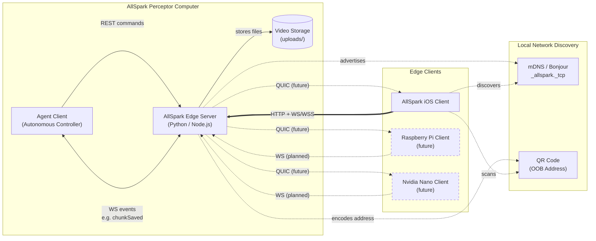
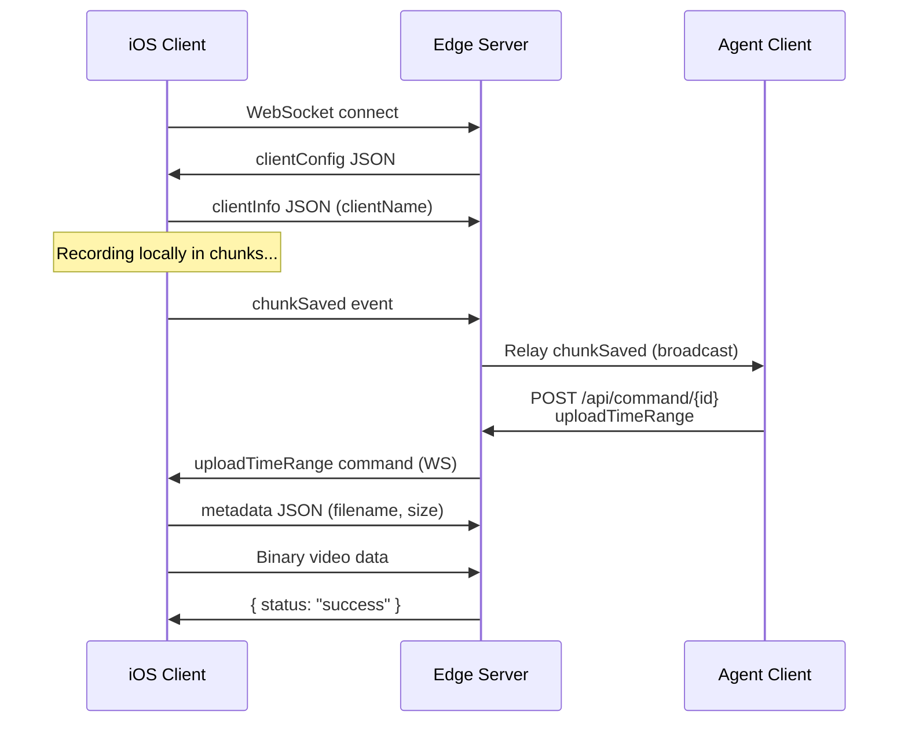

# AllSpark Edge Server — Requirements & Architecture

> **Purpose**: Machine- and human-readable reference for the AllSpark Edge Server's features, architecture, and source layout.

## System Context

## Source File Index

| File | Role | Key Symbols |
|------|------|-------------|
| [python/server.py](python/server.py) | Python server (aiohttp) | `websocket_handler`, `handle_command_post`, `handle_status`, `handle_health`, `register_zeroconf`, `init_app` |
| [node/server.js](node/server.js) | Node.js server | `requestHandler`, `wss.on("connection")`, `deepMerge`, `getLocalIP` |
| [index.html](index.html) | Web control interface | `updateHealthStatus`, `updateConnectionStatus`, `sendUploadTimeRangeCommand` |
| [python/config.yaml](python/config.yaml) | Shared configuration | `hostname`, `port`, `clientConfig`, `uploadPath`, `keyFile`, `certFile` |
| [examples/agent_client/](examples/agent_client/) | Agent client example | Demonstrates REST+WS agent workflow |

## Feature Requirements

### HTTP API

| ID | Requirement | Source |
|----|-------------|--------|
| REQ-ES-001 | `GET /` serves `index.html` web interface | [server.py#handle_index](python/server.py), [server.js#requestHandler](node/server.js) |
| REQ-ES-002 | `GET /api/health` returns `{ status, timestamp, uptime }` | [server.py#handle_health](python/server.py) |
| REQ-ES-003 | `GET /api/status` returns connection list with `id`, `clientName`, `filename`, `receivedData` | [server.py#handle_status](python/server.py) |
| REQ-ES-004 | `POST /api/command/{connectionId}` dispatches commands (`uploadTimeRange`, `record`) to a connected client | [server.py#handle_command_post](python/server.py) |

### WebSocket Protocol

| ID | Requirement | Source |
|----|-------------|--------|
| REQ-ES-010 | Server sends `clientConfig` (videoFormat, chunkDuration, bufferMax) immediately on connection | [server.py#websocket_handler](python/server.py) |
| REQ-ES-011 | Client sends `clientInfo` with `clientName` for identification | [endpoints.md](docs/endpoints.md) |
| REQ-ES-012 | Client sends JSON metadata (`filename`, `filesize`, `mimetype`) then binary data for upload | [endpoints.md](docs/endpoints.md) |
| REQ-ES-013 | Server writes binary data to file stream under `uploads/` | [server.py#websocket_handler](python/server.py) |
| REQ-ES-014 | Server relays `chunkSaved` events to all other connected clients (agent broadcast) | [server.js](node/server.js) |
| REQ-ES-015 | Server sends `uploadTimeRange` or `record` commands to clients via WS | [endpoints.md](docs/endpoints.md) |
| REQ-ES-016 | Keep-alive ping/pong mechanism prevents stale connections | [server.js](node/server.js) |

### Infrastructure

| ID | Requirement | Source |
|----|-------------|--------|
| REQ-ES-020 | Bonjour/mDNS service advertisement as `_allspark._tcp` | [server.py#register_zeroconf](python/server.py) |
| REQ-ES-021 | SSL/TLS support via configurable key/cert files for WSS/HTTPS | [server.py#init_app](python/server.py), [server.js](node/server.js) |
| REQ-ES-022 | Shared `python/config.yaml` with deep-merge of user overrides and defaults | [python/config.yaml](python/config.yaml), [server.py#load_config](python/server.py) |
| REQ-ES-023 | Dual implementation parity: Python (aiohttp) and Node.js | [python/](python/), [node/](node/) |
| REQ-ES-025 | `communicationsPolicy` in `clientConfig` specifying per-protocol enable/disable for mobile devices | [python/config.yaml](python/config.yaml) |

### Web Interface

| ID | Requirement | Source |
|----|-------------|--------|
| REQ-ES-030 | Active connections list with client names, IDs, upload status | [index.html#updateConnectionStatus](index.html) |
| REQ-ES-031 | Health status display with uptime and protocol badge | [index.html#updateHealthStatus](index.html) |
| REQ-ES-032 | Request Upload Time Range controls with quick presets and persistence | [index.html#sendUploadTimeRangeCommand](index.html) |
| REQ-ES-033 | QR code display encoding server address for mobile pairing | [index.html](index.html) |

## Upload Sequence

## Planned / Future

- **QUIC transport** for high-bandwidth binary video/depth pulls
- **Raspberry Pi** and **Nvidia Nano** edge clients
- Secure transport (WSS/HTTPS) is easy to configure; clients try secure before insecure
- UWB/NFC/Satellite enforcement in `communicationsPolicy` (pending public iOS API or cross-platform clients)
