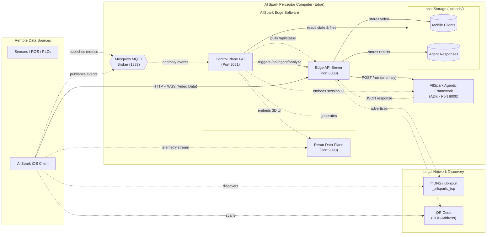
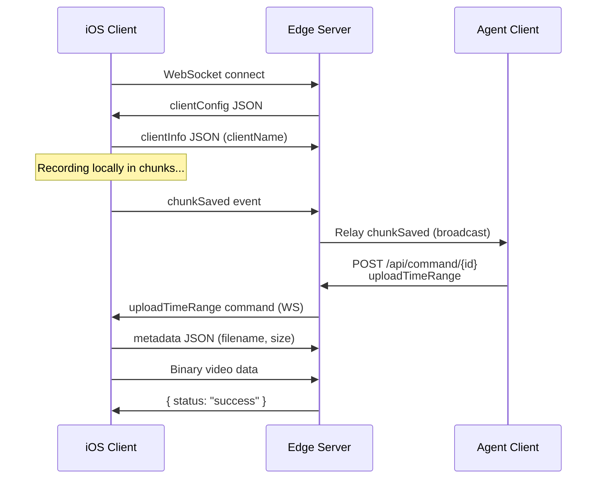

# AllSpark Edge Server — Requirements & Architecture

> **Purpose**: Machine- and human-readable reference for the AllSpark Edge Server's features, architecture, and source layout.

## System Context

## Source File Index

| File / Module | Role | Core Responsibility |
|-------------|------|-------------------|
| [`python/server.py`](python/server.py) | Edge API Server | `aiohttp` runner, WSS chunk parsing, `/api/` routers |
| [`python/agent_service/`](python/agent_service/) | AI Framework Link | `AgentApiClient`, `AnomalyResponseStore`, analysis payload generation |
| [`python/control_plane/main.py`](python/control_plane/main.py) | Control Plane Host | `ui.run` sidecar spinup, fastAPI static mounting |
| [`python/control_plane/theme.py`](python/control_plane/theme.py) | Nav & Health Polling | Background header rendering, 5-second asynchronous TCP pings |
| [`python/control_plane/pages/`](python/control_plane/pages/) | UI Routing Views | Independent GUI layout pages (`agent`, `clients`, `settings`, `debug`) |
| [`python/config.yaml`](python/config.yaml) | Shared Settings DB | Deep-merged configuration defining network interfaces and vault paths |
| [`TESTING_AGENT_INTEGRATION.md`](TESTING_AGENT_INTEGRATION.md) | Agent Test Guide | CLI smoke-test automation and developer integration workflows |

## Feature Requirements

### HTTP API

| ID | Requirement | Source |
|----|-------------|--------|
| REQ-ES-001 | Control Plane UI hosted as detached sidecar on `base_port + 1` | [control_plane/main.py](python/control_plane/main.py) |
| REQ-ES-002 | `GET /api/health` returns `{ status, uptime, protocols, port }` | [server.py](python/server.py) |
| REQ-ES-003 | `GET /api/status` returns connection list with `id`, `clientName`, and last transfer metrics | [server.py](python/server.py) |
| REQ-ES-004 | `GET /api/config` returns dynamic mobile client policies and video boundaries | [server.py](python/server.py) |
| REQ-ES-005 | `POST /api/command/{connectionId}` dispatches commands (`uploadTimeRange`, `record`) | [server.py](python/server.py) |
| REQ-ES-006 | `POST /api/agent/analyze` aggregates anomalies and submits to AllSpark ADK | [server.py](python/server.py) |
| REQ-ES-007 | `POST /api/agent/continue` routes a follow-up string prompt to an existing ADK session | [server.py](python/server.py) |
| REQ-ES-008 | `GET /api/agent/responses` lists chronological agent interactions persisted on disk | [server.py](python/server.py) |

### WebSocket Protocol

| ID | Requirement | Source |
|----|-------------|--------|
| REQ-ES-010 | Server sends `clientConfig` (videoFormat, chunkDuration, bufferMax) immediately on connection | [server.py#websocket_handler](python/server.py) |
| REQ-ES-011 | Client sends `clientInfo` with `clientName` for identification | [endpoints.md](docs/endpoints.md) |
| REQ-ES-012 | Client sends JSON metadata (`filename`, `filesize`, `mimetype`) then binary data for upload | [endpoints.md](docs/endpoints.md) |
| REQ-ES-013 | Server writes binary data to file stream under `uploads/` | [server.py#websocket_handler](python/server.py) |
| REQ-ES-014 | Server relays `chunkSaved` events to all other connected clients (agent broadcast) | [server.js](node/server.js) |
| REQ-ES-015 | Server sends `uploadTimeRange` or `record` commands to clients via WS | [endpoints.md](docs/endpoints.md) |
| REQ-ES-016 | Keep-alive ping/pong mechanism prevents stale connections | [server.js](node/server.js) |

### Infrastructure

| ID | Requirement | Source |
|----|-------------|--------|
| REQ-ES-020 | Bonjour/mDNS service advertisement as `_allspark._tcp` | [server.py#register_zeroconf](python/server.py) |
| REQ-ES-021 | SSL/TLS support via configurable key/cert files for WSS/HTTPS | [server.py#init_app](python/server.py), [server.js](node/server.js) |
| REQ-ES-022 | Shared `python/config.yaml` with deep-merge of user overrides and defaults | [python/config.yaml](python/config.yaml), [server.py#load_config](python/server.py) |
| REQ-ES-023 | Dual implementation parity: Python (aiohttp) and Node.js | [python/](python/), [node/](node/) |
| REQ-ES-025 | `communicationsPolicy` in `clientConfig` specifying per-protocol enable/disable for mobile devices | [python/config.yaml](python/config.yaml) |

### Web Interface

| ID | Requirement | Source |
|----|-------------|--------|
| REQ-ES-030 | Header navigation bar renders universal API polling status for all core services | [theme.py](python/control_plane/theme.py) |
| REQ-ES-031 | `/agent` renders the stored response feed and the interactive ADK `iframe` session viewer | [pages/agent.py](python/control_plane/pages/agent.py) |
| REQ-ES-032 | `/clients` displays live WS connections and provides the manual "Request Upload Range" triggers | [pages/clients.py](python/control_plane/pages/clients.py) |
| REQ-ES-033 | `/settings` allows two-way reactive binding and deep-merging to the underlying `config.yaml` | [pages/settings.py](python/control_plane/pages/settings.py) |
| REQ-ES-034 | `/debug` exposes developer JSON scaffolding capabilities for manual anomaly injection | [pages/debug.py](python/control_plane/pages/debug.py) |

## Control Plane Architecture Decisions

The detached NiceGUI control plane operates under the following design constraints:

1. **Framework Selection (Python-Native):** Utilizing [NiceGUI](https://nicegui.io/) allows the frontend and backend logic to reside purely in Python, ensuring reactive data binding without context-switching to isolated JS SPA frameworks.
2. **The Sidecar Pattern:** Executed as a completely detached process on a port offset (`base_port + 1`) to guarantee that heavy UI rendering, DOM patching, and data iteration do not accidentally block the core Edge Server's critical `aiohttp` event loop running QUIC and WS streams.
3. **Single Source of Truth:** The sidecar UI natively reads the unified `python/config.yaml`.
4. **Data Integration Strategies:**
   - **REST Polling:** Actively polls the `/api/status` endpoint to pull mobile rig connection states without establishing complex inter-process bridges.
   - **Shared File Mounts:** Points `app.add_media_files()` dynamically at the configured `uploads/` directory to serve video playback via raw OS filesystem traversal rather than internal data transfers.
   - **Direct Broker Attachment:** Instantiates a dedicated background thread for `paho-mqtt` to intercept and sink anomalies directly from port `1883`, preventing Edge Server bottlenecking.
   - **Rerun.io Wrapper:** Uses an `iframe` boundary to dynamically embed the `rerun-sdk` native Rust 3D visualizations inside the standard Python dashboard view.

## Upload Sequence

## Planned / Future

- **QUIC transport** for high-bandwidth binary video/depth pulls
- **Raspberry Pi** and **Nvidia Nano** edge clients
- Native integration of the Control Plane sidecar into the main Edge Server application layer, unifying the footprint once performance limits are fully mapped
- Replacing the Rerun.io `iframe` mocking with a fully bound `rerun-sdk` live data ingestion pipeline from the mobile edge clients
- Implementation of comprehensive SSL/JWT context guards between the isolated dashboard services
